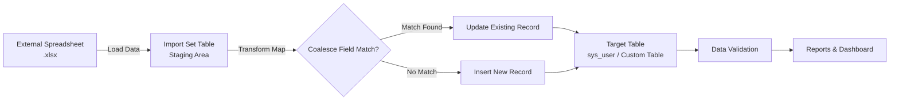

# ServiceNow Import Sets & Transform Maps Micro Project

[](#)
[](#)
[](#)
[](#)

---

## 📌 Project Overview

This micro project demonstrates how to import structured data from an external spreadsheet into the **ServiceNow** platform using **Import Sets** and **Transform Maps**. 

The project simulates a real-world enterprise scenario where bulk employee records are received in Microsoft Excel (`.xlsx`) format and must be securely migrated into ServiceNow with high accuracy and data integrity.

### Key Highlights
- **Staging Mechanism:** Loads raw spreadsheet data into a dedicated Import Set table acting as a staging boundary.
- **Field Mapping:** Configures a Transform Map to match source columns to target table attributes.
- **Deduplication with Coalesce:** Sets unique matching keys (e.g., Employee ID or Email) to handle insert vs. update (upsert) behavior.
- **End-to-End Validation:** Inspects transformation logs, verifies records in the target table, and visualizes outcomes through reports and dashboards.

---

## 🏗️ Architecture & Workflow



---

## 📁 Repository Structure

```text
servicenow-import-transform-map/
│
├── README.md
│
├── data/
│   ├── Sample_Spreadsheet.xlsx          # Initial bulk employee data for staging
│   └── Updated_Spreadsheet.xlsx         # Delta/updated employee data to test coalesce
│
├── screenshots/
│   ├── 01-spreadsheet.png               # Source spreadsheet view
│   ├── 02-target-table.png              # Target table schema & state before import
│   ├── 03-import-set.png                # Loaded import set staging table
│   ├── 04-transform-map.png             # Transform map configuration
│   ├── 05-field-mapping.png             # Field map & mapping assist layout
│   ├── 06-coalesce.png                  # Coalesce field setting
│   ├── 07-transform-result.png          # Execution state (completed, inserts, updates)
│   ├── 08-report.png                    # Data verification report
│   └── 09-dashboard.png                 # Summary metrics & dashboard
│
└── documentation/
    └── PROJECT_DOCUMENTATION.md         # Comprehensive project documentation
```

---

## ⚙️ Step-by-Step Implementation

### Step 1: Data Preparation
1. Prepare `Sample_Spreadsheet.xlsx` containing structured employee fields (e.g., `Employee ID`, `First Name`, `Last Name`, `Email`, `Department`, `Title`).
2. Verify data types, column headers, and ensure there are no corrupt rows.

### Step 2: Load Data into Import Set Table
1. Navigate to **System Import Sets > Load Data** in ServiceNow.
2. Select **Create table** and specify a label (e.g., `u_employee_import_staging`).
3. Choose the file source as **File**, attach `Sample_Spreadsheet.xlsx`, and submit.
4. Review the loaded rows in the generated staging table.

### Step 3: Configure Transform Map
1. Navigate to **System Import Sets > Create Transform Map**.
2. Set:
   - **Name**: `Employee Import Transform Map`
   - **Source Table**: Staging table created in Step 2
   - **Target Table**: Target table (e.g., `sys_user` or target custom table)
3. Save the record.

### Step 4: Map Fields
1. Under Related Links, click **Mapping Assist** (or **Auto Map Matching Fields**).
2. Align source fields to target fields:
   - `Employee ID` ➔ `user_name` / `employee_number`
   - `First Name` ➔ `first_name`
   - `Last Name` ➔ `last_name`
   - `Email` ➔ `email`
   - `Department` ➔ `department`
   - `Title` ➔ `title`

### Step 5: Configure Coalesce Strategy
1. In the Field Maps list, locate the unique identifier field (e.g., `Employee ID` or `Email`).
2. Set **Coalesce** to `true`.
3. *Outcome:* If a record with that identifier exists in the target table, ServiceNow updates it; otherwise, a new record is inserted.

### Step 6: Execute Transformation & Review Results
1. Click **Transform** on the Transform Map or Import Set.
2. Verify execution status:
   - State: `Complete`
   - Count of `Inserts`, `Updates`, `Ignored`, and `Errors`.
3. Check the target table to ensure rows exist and fields match expectations.

### Step 7: Test Updates (Delta Import)
1. Load `Updated_Spreadsheet.xlsx` containing modified titles/departments for existing IDs and some new records.
2. Run the transform again and confirm that existing records are updated while new records are inserted without duplication.

### Step 8: Build Reports & Dashboard
1. Create reports grouped by Department, Creation Date, or Active Status.
2. Pin reports to an **Employee Migration Dashboard** for visibility and monitoring.

---

## 🖼️ Visual Evidence & Screenshots

| File | Description |
|------|-------------|
| `01-spreadsheet.png` | External spreadsheet data ready for ingestion |
| `02-target-table.png` | Target ServiceNow table prior to transformation |
| `03-import-set.png` | Staging import set table with loaded rows |
| `04-transform-map.png` | Transform Map header and configuration details |
| `05-field-mapping.png` | Field mapping grid and source-to-target associations |
| `06-coalesce.png` | Coalesce flag configured on unique identifier |
| `07-transform-result.png` | Transform execution summary (inserts, updates, errors) |
| `08-report.png` | Generated analytical report on imported data |
| `09-dashboard.png` | Consolidated migration analytics dashboard |

---

## 🎯 Key Learning Outcomes

- Understanding the role of **Staging Tables** in protecting production databases during bulk imports.
- Practical experience with **Field Maps**, **Automapping**, and **Mapping Assist**.
- Mastery of **Coalesce fields** to maintain data integrity and prevent duplicates.
- Validating bulk data loads and communicating results using **ServiceNow Reporting**.
