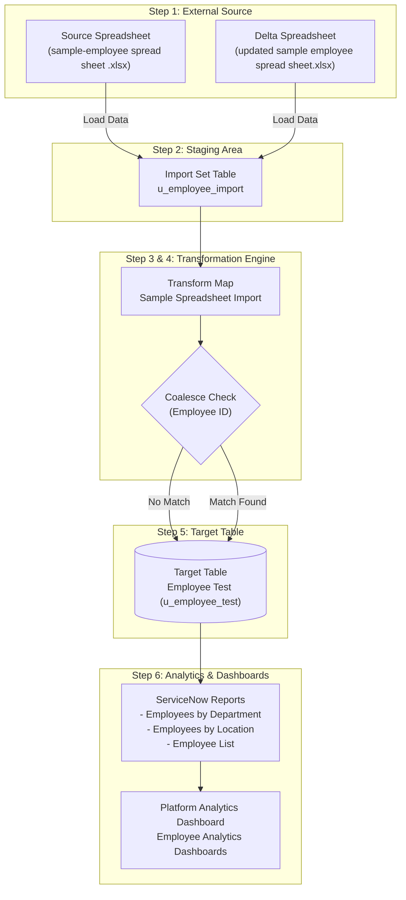

# ServiceNow Import Sets & Transform Maps

[](#)
[](#)
[](#)
[](#)
[](#)

---

## 📌 Project Overview

This micro project demonstrates the complete end-to-end process of importing structured data from an external spreadsheet into the **ServiceNow** platform using **Import Sets** and **Transform Maps**.

The project simulates a real-world scenario where bulk employee data is received in Excel format and must be migrated into ServiceNow efficiently, securely, and with high data integrity. The spreadsheet data is first loaded into a temporary staging table (**Import Set Table**), followed by a **Transform Map** configuration that maps source fields to the target custom table (**Employee Test**).

To prevent duplicate records upon recurring or updated imports, the **Coalesce** feature is configured on the `Employee ID` field, allowing seamless upsert operations (inserting new records and updating existing ones). Finally, interactive **Reports** and an **Employee Analytics Dashboard** are built to provide actionable visibility into the migrated data.

---

## 🏗️ Architecture & Data Flow



---

## 📁 Repository Structure

```text
servicenow-import-transform-map/
│
├── README.md                                          # Main project overview and instructions
│
├── data/
│   ├── sample-employee spread sheet .xlsx             # Initial employee dataset (5 records)
│   ├── updated sample employee spread sheet.xlsx      # Updated/delta employee dataset for coalesce testing
│   └── Employee Analytics Dashboard.ppt               # Final project presentation deck
│
├── screenshots/
│   ├── 1 - spread creation.png                        # Step 1: Google Spreadsheet data preparation
│   ├── 2 - table creation.png                         # Step 2: Target table (u_employee_test) & form layout
│   ├── 3 - Import table .png                          # Step 3: Import Set staging table (u_employee_import)
│   ├── 4 - transform creation.png                     # Step 4: Transform Map creation & field mapping
│   ├── 5 - transform data and validate.png            # Step 5: Execution result & target table validation
│   ├── 6 - Enable Coalesce to Avoid Duplicate Records.png # Step 6: Coalesce flag enabled on Employee ID
│   ├── 7 - inset new data.png                         # Step 7: Delta import with insert and update counts
│   ├── 8 - report.png                                 # Step 8: Reports created on Employee Test table
│   └── 9  - dashboard.png                             # Step 9: Multi-chart Employee Analytics Dashboard
│
└── documentation/
    └── PROJECT_DOCUMENTATION.md                       # Detailed technical implementation guide
```

---

## 🛠️ Step-by-Step Implementation

### 1. Spreadsheet Data Preparation
- Created structured employee data in Google Sheets containing the following attributes:
  - **Employee ID** (`SB001`, `SB002`, `SB003`, `SB004`, `SB005`)
  - **Name** (`user1`, `user2`, `user3`, `user4`, `user5`)
  - **Email** (`user1@gmail.com`, `user2@gmail.com`, etc.)
  - **Department** (`Servicenow`, `Salesforce`)
  - **Location** (`Tamil Nadu`)
- Downloaded file locally as `sample-employee spread sheet .xlsx`.
- 📷 *Reference:* [`screenshots/1 - spread creation.png`](file:///d:/TNskill%20github/servicenow-import-transform-map/screenshots/1%20-%20spread%20creation.png)

---

### 2. Custom Target Table Creation (`u_employee_test`)
- **Navigation:** **Tables > Create New**
- **Configuration:**
  - Label: `Employee Test`
  - Name: `u_employee_test`
- Under **Related Links**, clicked **Show Form**.
- Clicked **Form Context Menu (Additional Actions / Hamburger icon)** > **Configure** > **Form Layout**.
- Created the following custom fields with type `String`:
  - `Employee ID`
  - `Employee Name`
  - `Email`
  - `Department`
  - `Location`
- Saved form layout and verified the fields render properly on the form.
- 📷 *Reference:* [`screenshots/2 - table creation.png`](file:///d:/TNskill%20github/servicenow-import-transform-map/screenshots/2%20-%20table%20creation.png)

---

### 3. Import Set Staging Table (`u_employee_import`)
- The Import Set table acts as a temporary staging container before validation and transformation.
- **Navigation:** **Application Navigator > System Import Sets > Load Data**
- **Configuration:**
  - Select: **Create table**
  - Label: `Employee Import`
  - Name: `u_employee_import` (auto-populated)
  - Source: **File** (`sample-employee spread sheet .xlsx`)
  - Sheet number: `1`, Header row: `1`
- Clicked **Submit**; verified staging state: `Completed` (Success).
- Clicked **Create Transform Map** to proceed.
- 📷 *Reference:* [`screenshots/3 - Import table .png`](file:///d:/TNskill%20github/servicenow-import-transform-map/screenshots/3%20-%20Import%20table%20.png)

---

### 4. Transform Map & Field Mapping
- **Configuration:**
  - Name: `Sample Spreadsheet Import`
  - Source Table: `Employee Import [u_employee_import]`
  - Target Table: `Employee Test [u_employee_test]`
- Clicked **Auto Map Matching fields** to align source fields to target fields.
- Saved the Transform Map record and verified mapping pairs.
- Clicked **Transform** to initiate data transformation into the target table.
- 📷 *Reference:* [`screenshots/4 - transform creation.png`](file:///d:/TNskill%20github/servicenow-import-transform-map/screenshots/4%20-%20transform%20creation.png)

---

### 5. Transform Data Execution & Data Validation
- The Transform engine mapped and populated records into the target `u_employee_test` table.
- **Navigation:** Open **Employee Test** (`u_employee_test.list`) via Application Navigator.
- Used **Personalize List Columns** (gear icon) to arrange the list view:
  - `Employee ID`, `Employee Name`, `Email`, `Department`, `Location`.
- Verified that all 5 employee records were accurately created without data truncation or format errors.
- 📷 *Reference:* [`screenshots/5 - transform data and validate.png`](file:///d:/TNskill%20github/servicenow-import-transform-map/screenshots/5%20-%20transform%20data%20and%20validate.png)

---

### 6. Enable Coalesce to Prevent Duplicate Records
- To ensure re-importing data does not produce duplicate records, **Coalesce** was configured.
- **Navigation:** **System Import Sets > Administration > Transform Maps**
- Opened `Sample Spreadsheet Import`.
- Under the **Field Maps** related list, located the unique identifier field: `Employee ID` (`u_employee_id`).
- Set **Coalesce** to `true` and saved the form.
- **Result:** Future transformations match existing records by `Employee ID` to perform updates instead of inserting duplicates.
- 📷 *Reference:* [`screenshots/6 - Enable Coalesce to Avoid Duplicate Records.png`](file:///d:/TNskill%20github/servicenow-import-transform-map/screenshots/6%20-%20Enable%20Coalesce%20to%20Avoid%20Duplicate%20Records.png)

---

### 7. Delta Load & Upsert Verification
- Prepared `updated sample employee spread sheet.xlsx` containing:
  - Modifications to existing records (e.g. updated emails and employee names).
  - Newly added employee records.
- **Navigation:** **System Import Sets > Load Data**
  - Table: **Existing table** (`Employee Import`)
  - Source: File (`updated sample employee spread sheet.xlsx`)
- Ran transform on `Sample Spreadsheet Import`.
- Opened **Transform History** to verify execution results:
  - **Inserts:** Count of new employee IDs.
  - **Updates:** Count of existing employee IDs with modified details.
  - **Ignored / Errors:** 0 errors.
- Tested idempotency by running the exact same file again: **0 Inserts**, **0 Updates**, and all records **Ignored**.
- 📷 *Reference:* [`screenshots/7 - inset new data.png`](file:///d:/TNskill%20github/servicenow-import-transform-map/screenshots/7%20-%20inset%20new%20data.png)

---

### 8. Reports on Employee Test Table
- **Navigation:** **All > Reports > View / Run** > **Create a report**
- **Report 1: Employees by Department**
  - Source Type: `Table`
  - Table: `Employee Test [u_employee_test]`
  - Type: `Pie` chart
  - Group by: `Department` | Aggregation: `Count`
- Additional reports created:
  - **Employees by Location**
  - **Employee List**
- 📷 *Reference:* [`screenshots/8 - report.png`](file:///d:/TNskill%20github/servicenow-import-transform-map/screenshots/8%20-%20report.png)

---

### 9. Platform Analytics Dashboard
- **Navigation:** **All → Platform Analytics → Dashboards**
- Clicked **Create dashboard** > Selected **In-line editor**.
- Dashboard Name: **`Employee Analytics Dashboards`**.
- Added Data Visualizations from library:
  1. `Employees by Department` (Pie Chart)
  2. `Employees by Location` (Distribution View)
  3. `Employee List` (Tabular Data Grid)
- Arranged and resized widgets; clicked **Save** and **Exit editing mode**.
- The presentation deck summarizing this dashboard is available in [`data/Employee Analytics Dashboard.ppt`](file:///d:/TNskill%20github/servicenow-import-transform-map/data/Employee%20Analytics%20Dashboard.ppt).
- 📷 *Reference:* [`screenshots/9  - dashboard.png`](file:///d:/TNskill%20github/servicenow-import-transform-map/screenshots/9%20%20-%20dashboard.png)

---

## 📸 Screenshots Directory Reference

| # | Screenshot Filename | Description |
|---|---------------------|-------------|
| 1 | `1 - spread creation.png` | External employee spreadsheet source data |
| 2 | `2 - table creation.png` | Custom table creation and Form Layout configuration |
| 3 | `3 - Import table .png` | Loading data into Import Set staging table |
| 4 | `4 - transform creation.png` | Transform Map configuration and Auto Map matching |
| 5 | `5 - transform data and validate.png` | Successful transformation and personalized list validation |
| 6 | `6 - Enable Coalesce to Avoid Duplicate Records.png` | Setting Coalesce to true on Employee ID field map |
| 7 | `7 - inset new data.png` | Delta import demonstrating update vs insert counts |
| 8 | `8 - report.png` | Interactive pie chart report grouped by department |
| 9 | `9  - dashboard.png` | Completed Employee Analytics Dashboard with multiple widgets |

---

## 🎯 Key Takeaways & Competencies

- **Staging Isolation:** Utilizing Import Sets to safely isolate raw external input from production tables.
- **Automated Mapping:** Leveraging Automap and Mapping Assist for swift schema alignment.
- **Data Integrity via Coalesce:** Mastering upsert logic to maintain a single source of truth without duplicate records.
- **Operational Reporting:** Converting transactional records into executive reports and Platform Analytics Dashboards.
